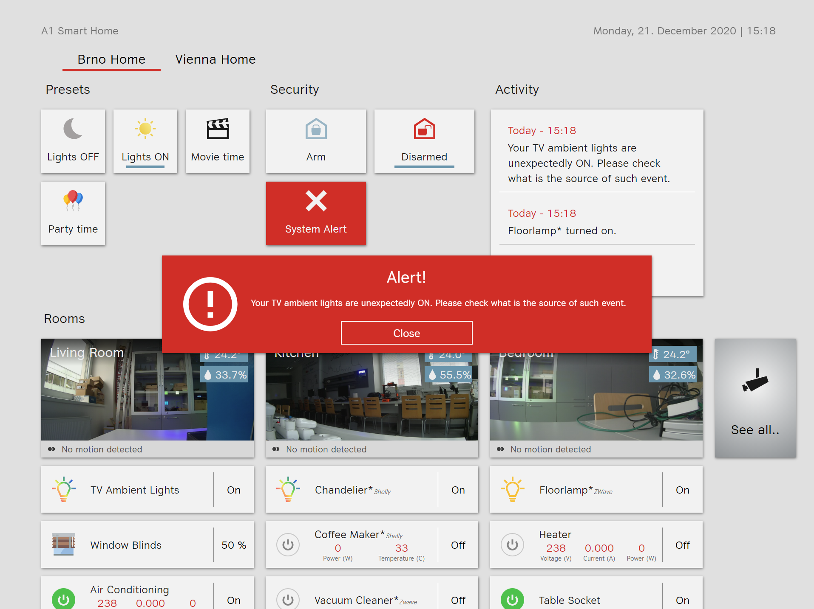
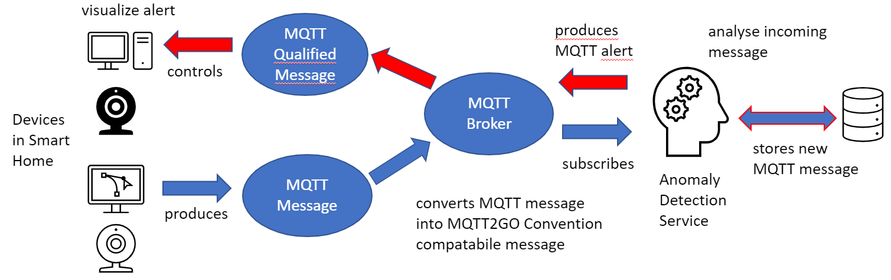

# MQTT Anomaly Detection Demo App

## Available Scripts
In the project directory, you can run:

### `mvn clean install`
Builds the app for production to the `target` folder. 

### `java -jar mqtt-data-mining-demo-1.0.0.jar`

Runs the app, the app connects to the `MySQL` database and to the predefined `MQTT Broker`. Using that the app analysis incoming messages store them in the database and in the case of anomaly throws an event back to the `MQTT Broker`.

## Application Workflow

